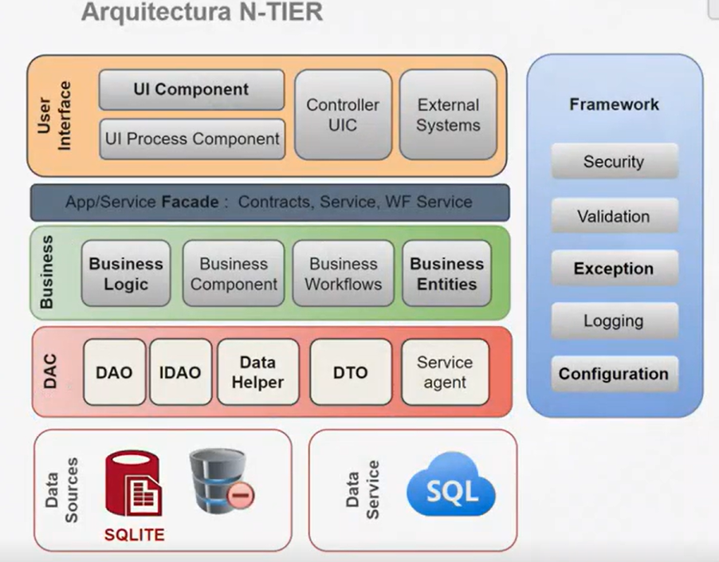
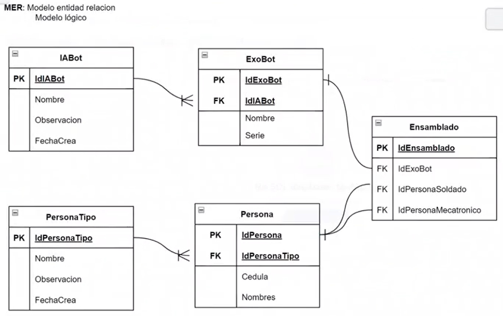
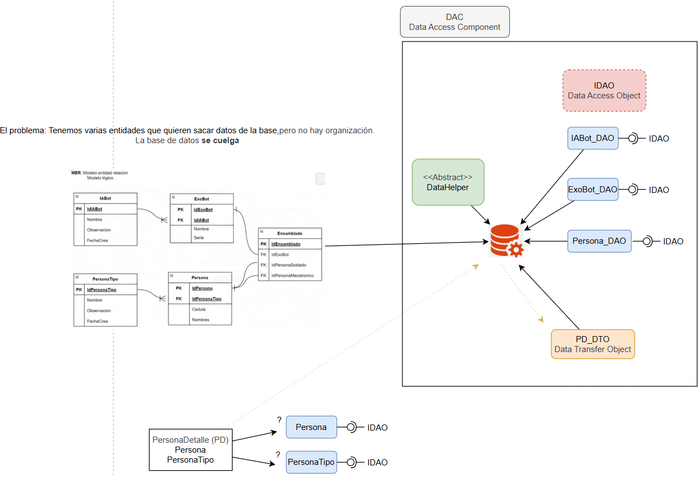
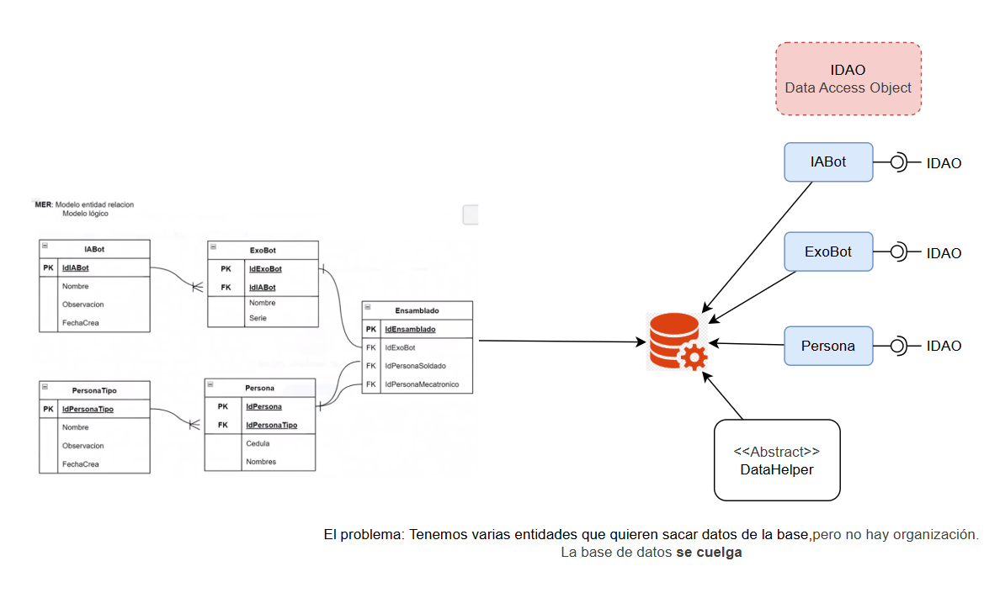
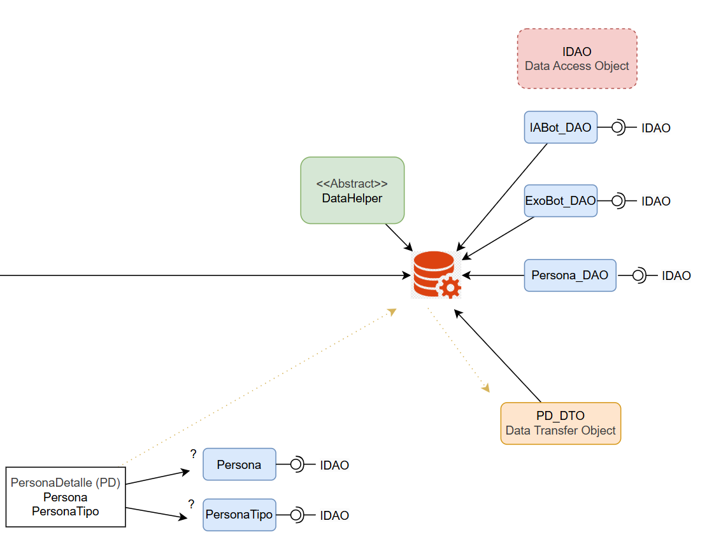
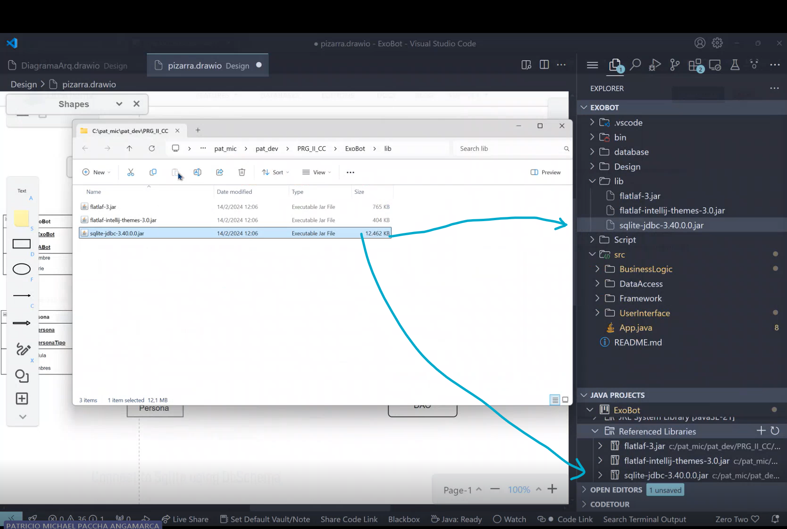

# Arquitectura N-Tier

>*Conceptos Previos*

### ¿Qué es CRUD?

CRUD es un acrónimo que representa las cuatro operaciones básicas que se pueden realizar sobre los datos en una base de datos o sistema de almacenamiento:

- **Create (Crear):** Permite agregar nuevos registros o datos.
- **Read (Leer):** Permite consultar o recuperar información existente.
- **Update (Actualizar):** Permite modificar datos ya existentes.
- **Delete (Eliminar):** Permite borrar registros o datos.

Estas operaciones son fundamentales en el desarrollo de aplicaciones, ya que permiten gestionar la información de manera completa y estructurada.
    

>>Capas de la Arquitectura



>*Figura 1|* De arriba hacia abajo --> Capa Física (Bases de Datos) --> Capas Lógicas

## Caso de Estudio -- EXOBOT

### *Mer (Modelo Entidad Relacion)*



### *DAC (Data Access Component)*

>Estructura General



1. *Uso de las DAO*

    

    >Dado que cada Clase creada necesita sacar información de la base de datos, es decir, aplicar un CRUD; es necesario controlar este tema.

    >Para ello, es necesario generar una interfaz, que obligue a cada clase a cumplir con esta regla y evitar que un programador no aplique CR, CD, etc. Sino el conjunto de operaciones CRUD.

    >*Nótese* que el DataHelper es una *clase abstracta*, esto se debe a que no queremos que se *instancie*
    
2.  *Uso del DTO* 

    

    >*Nótese* que si yo quisiera generar una tabla que combine datos de otras dos (o más tablas), un DAO ya no me sería útil, ya que no calzaría en ninguna tabla por separado, por tanto...

    > Con un *DTO* me encargo de leer la información de tablas (datos) *combinados*

    >Nota: Las reporterías siempre pasan por un DTO, para extraer toda la informacion que se necesita

### Prototipado del Proyecto en VSCode

> ¿Qué es jdbc?

JDBC (Java Database Connectivity) es una API de Java que permite conectar y ejecutar consultas con bases de datos desde aplicaciones Java. Proporciona un conjunto de clases e interfaces para:

- Conectarse a una base de datos.
- Ejecutar sentencias SQL (consultas, inserciones, actualizaciones, eliminaciones).
- Recuperar y manipular los resultados de las consultas.

JDBC es fundamental para el acceso a datos en aplicaciones Java, ya que permite interactuar con diferentes sistemas de gestión de bases de datos de manera uniforme.

> Procura copiar la ruta en específico en el apartado: Referenced Libraries, con el fin de no existir futuros problemas de conexión.



> El DataHelper, a más de evitar instanciarse, no puede duplicarse. Por lo tanto, debe ser de forma *estática*.

1. *Código para Data Helper*

```java
public abstract class SQLiteDataHelper {

    private static final String DBPathConnection = "jdbc:sqlite:DataBase//EXOBOT.sqlite";
    private static Connection conn = null;
    // protected SQLiteDataHelper(){}; 

   protected static synchronized Connection openConnection() throws Exception{
        try {
            if(conn == null)
                conn = DriverManager.getConnection(DBPathConnection); //me conecto a la base de datos
        } catch (SQLException e) {
            throw e; //new Exception(e,"SQLiteDataHelper","Fallo la coneccion a la base de datos");
        } 
        return conn;
    }


    protected static void closeConnection() throws Exception{
            try {
                if (conn != null)
                    conn.close();
            } catch (Exception e) {
                throw e;//new Exception(e,"SQLiteDataHelper", "Fallo la conección con la base de datos");
            }
    }
}

```
>La clase es *abstracta* debido a que queremos ue todas las clases hereden de esta y no creen más DataHelper(s).

> La clase es *estática* porque se requiere una *única* forma de ingreso, que es por medio del DataHelper.


- Catalogo son temas de bajo crecimiento como sexo

- Cuando construyes primero construyes el papa, pero cuando destruyes, primero destruyes los hijos

```java
DROP TABLE IF EXISTS Catalogo; //Elimino hijo, luego papa

DROP TABLE IF EXISTS CatalogoTipo;

CREATE TABLE CatalogoTipo( //Construyo papa luego hijo
     IdCatalogoTipo              INTEGER         NOT NULL PRIMARY KEY AUTOINCREMENT
    ,Nombre                      VARCHAR(10)     NOT NULL UNIQUE
    ,Descripcion                 VARCHAR(90)     NOT NULL UNIQUE

    ,Estado                      VARCHAR(1)      NOT NULL DEFAULT 'A'
    ,FechaCreacion               DATETIME        DEFAULT (datetime('now','localtime'))
    ,FechaModifica               DATETIME
);


CREATE TABLE Catalogo(
     IdCatalogo              INTEGER         NOT NULL PRIMARY KEY AUTOINCREMENT
    ,Nombre                      VARCHAR(10)     NOT NULL UNIQUE
    ,Descripcion                 VARCHAR(90)     NOT NULL UNIQUE

    ,Estado                      VARCHAR(1)      NOT NULL DEFAULT 'A'
    ,FechaCreacion               DATETIME        DEFAULT (datetime('now','localtime'))
    ,FechaModifica               DATETIME
);

```
- atributos de la clase en minuscula y privados
- Primero generamos el DTO, luego el DAO
- De preferencia metodos de tipo NO PRIMITIVO para poder transformarlos

## Pasos para generar una nueva tabla y aplicar CRUD

1. Generar un DTO con el nombre de la tabla
    >En el DTO, se encuentran los atributos de la tabla, los getters y setters y tambien los constructores.

```java
    package DataAccess.DTO;

public class EstadoCivilDTO {
    private Integer IdCatalogo     ;
    private Integer IdCatalogoTipo ;
    private String  Nombre         ;
    private String  Descripcion    ;
    private String  Estado         ;
    private String  FechaCreacion  ;
    private String  FechaModifica  ;
    


    public EstadoCivilDTO (){}
    
    public EstadoCivilDTO(Integer idCatalogo, Integer idCatalogoTipo, String nombre, String descripcion, String estado,
        String fechaCreacion, String fechaModifica) {
        IdCatalogo = idCatalogo;
        IdCatalogoTipo = idCatalogoTipo;
        Nombre = nombre;
        Descripcion = descripcion;
        Estado = estado;
        FechaCreacion = fechaCreacion;
        FechaModifica = fechaModifica;
    }

        public Integer getIdCatalogo() {
        return IdCatalogo;
    }

    public void setIdCatalogo(Integer idCatalogo) {
        IdCatalogo = idCatalogo;
    }

    public Integer getIdCatalogoTipo() {
        return IdCatalogoTipo;
    }

    public void setIdCatalogoTipo(Integer idCatalogoTipo) {
        IdCatalogoTipo = idCatalogoTipo;
    }

    public String getNombre() {
        return Nombre;
    }

    public void setNombre(String nombre) {
        Nombre = nombre;
    }

    public String getDescripcion() {
        return Descripcion;
    }

    public void setDescripcion(String descripcion) {
        Descripcion = descripcion;
    }

    public String getEstado() {
        return Estado;
    }

    public void setEstado(String estado) {
        Estado = estado;
    }

    public String getFechaCreacion() {
        return FechaCreacion;
    }

    public void setFechaCreacion(String fechaCreacion) {
        FechaCreacion = fechaCreacion;
    }

    public String getFechaModifica() {
        return FechaModifica;
    }

    public void setFechaModifica(String fechaModifica) {
        FechaModifica = fechaModifica;
    }

    @Override
    public String toString(){

        return  getClass().getName() // me devuelve el paquete donde está y el nombre de la clase (lo ocupo para verificar que se este copiando lo que debe copiarse)
        + "\n IdCatalogo:       "    +getIdCatalogo()
        + "\n IdCatalogoTipo:   "    +getIdCatalogoTipo()
        + "\n Nombre:           "    +getNombre()
        + "\n Descripcion:      "    +getDescripcion()
        + "\n Estado:           "    +getEstado()
        + "\n FechaCreacion:    "    +getFechaCreacion()
        + "\n FechaModifica:    "    +getFechaModifica();

    }
}
```

2. Generar el DAO

3. Conectar y ejecutar DDL

3. Conectar y Ejecturar DML

3. Llamar a constructortes y funciones en App.java

- Si quisiera sacar datos especificos dado el getAll

```java

try {
    SexoBL sBL = new SexoBL();
    List<SexoDTO> lista = sBL.getAll();
    if (lista.size() > 1) {
        System.out.println(lista.get(1).toString());
    } else {
        System.out.println("No hay segundo elemento.");
    }
} catch (Exception e) {
    System.out.println(e.toString());
}

```

- El inge por facilidad y ense;anza genra abreviaturas al declarar clases, pero nosotros debemos escribir las palabras completas.

## Importancia de las clases BL

> En cada una de estas clases, se pueden implmentar las reglas de negocio.

> Temas como aumentar el IVA, la forma de presentar información, aplicar descuentos, etc. Aparecen aquí.

> Una clase BL, se encarga de llamar al DTO, quien se mueve por la base de datos y trae la información correspondiente.

```java
public class HIPersonaTipoBL {

    private PersonaTipoDTO ptDTO;
    private PersonaTipoDAO ptDAO = new PersonaTipoDAO();

    public HIPersonaTipoBL(){}

    public List<PersonaTipoDTO> getAll() throws Exception {
        List<PersonaTipoDTO> lst = new ArrayList<>();
        lst = ptDAO.readAll();
        return lst;
    }
    
    public PersonaTipoDTO getBy(int idEstadoCivil) throws Exception{
        ptDTO = ptDAO.readBy(idEstadoCivil);
        return ptDTO;
    }

    public boolean add(PersonaTipoDTO regDTO) throws Exception{
        return ptDAO.create(regDTO);
    }

    public boolean update(PersonaTipoDTO regDTO) throws Exception{
        return ptDAO.update(ptDTO);
    }

    public boolean delete(int regDTO) throws Exception{
        return ptDAO.delete(regDTO);
    }

    public Integer getRowCount() throws Exception{
        return ptDAO.getCountRow(); //por cambiar orden palabra
    }


}

```

## Importancia del manejo de Excpeciones

> El manejo de excepciones evita sorpresas para el programador y el cliente, indicándole de manera entendible cuál fue el error que apareció.

### Tipos de Excepciones en Java

1. Uso del bloque try - catch
- En el bloque try, se encuentra la lógica, el código como tal, mientras que en el bloque catch, unicamente se encuentra el error, no se implementa lógica nueva.

```java
        int a[] = {10,0}, b = 10;

        try {
            int resultadoA = a[0]/2;
            int resultado = a[1]/b;
        } 
        catch (ArithmeticException e) {
            System.out.println("Error, has dividido por 0... " + e.getMessage());
        }
        catch(Exception e){
            System.out.println("Ocurrió una excepción " + e.getMessage());
        } finally {
            System.out.println("Finally: Ejecucion con o sin error ");
        }

```
> Es necesario que en el catch, el programa avise cual es el problema, de no hacerlo, no podremos darnos cuenta que el codigo se puede estar rompiendo por dentro, ya que el prgrama no lo avisa.

> Usar Finally, implica que haya o no error, siempre aparecerá.

> *ATENCIÓN:* Si se requiere generar una excepción en específico, esta debe ir antes de la excepción general.

> Los hackers aprovechan los mensajes en seco para sacar información sobre cómo hacer caer el programa. *Nunca* muestres la información completa del error al usuario, brinda un mensaje más neutral que no vulnere el programa.


### Uso de una Excepción perzonalizada

1. Creamos la carpeta FrameWork

2. Generamos una clase, la cual servirá de excepción personalizada

```java
package Framework;

public class HIException extends Exception{

    public HIException(String e, String clase, String metodo){
        //grabar el lig
        //System.out.println("[ERROR APP --> LOG] " + clase + "." + metodo + " : " + e);
    }

    @Override
    public String getMessage(){
        return "NO sea sapo..";
    }

}
```
> SplashScreenForm, no te olvides de poner el sufijo de la carpeta correspondiente.

- los elementos estáticos me ayudan a que si debo volver a llmar cosas, no gasten memoria y más bien ocupen lo que ya se tiene.